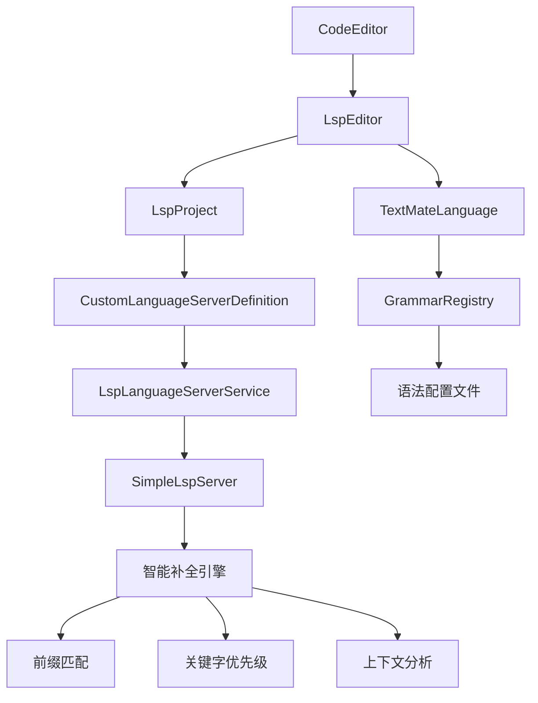

# LSP 智能补全集成指南

## 📋 概述

本项目已成功集成LSP（Language Server Protocol）智能代码补全功能，基于sora-editor官方LSP API实现。

editor-lsp不包含：
❌ 语言服务器实现 - 没有Java/C++/Python的语法分析器
❌ 语法分析引擎 - 没有真正的代码解析能力
❌ 智能补全逻辑 - 没有基于语义的补全算法
❌ 错误检查 - 没有语法/语义错误检测

## 🏗️ 架构设计

### 1. 核心组件



### 2. 智能补全流程

1. **文档同步**：`SimpleLspServer`实时存储和更新文档内容
2. **前缀提取**：分析光标位置，提取用户当前输入的前缀
3. **智能过滤**：根据前缀过滤所有可能的补全建议
4. **优先级排序**：关键字优先，精确匹配优先，按类型分组
5. **补全展示**：返回排序后的补全列表给编辑器

## ✨ 核心功能特性

### 🎯 **智能前缀匹配**
- ✅ 实时提取用户输入前缀
- ✅ 大小写不敏感的匹配
- ✅ 精确匹配优先于模糊匹配

### 🏷️ **正确的补全类型**
- ✅ **关键字** (KIND_KEYWORD = 14): `int`, `if`, `class`等
- ✅ **函数** (KIND_FUNCTION = 3): `print()`, `len()`等  
- ✅ **类** (KIND_CLASS = 7): `String`, `ArrayList`等
- ✅ **代码片段** (KIND_SNIPPET = 15): 模板代码

### 📊 **智能排序优先级**
1. **精确匹配** > 模糊匹配
2. **关键字** > 其他类型
3. **长度短** > 长度长

### 💡 **示例：在C++中输入"i"**
现在会正确显示：
- `int` (关键字) ✅
- `if` (关键字) ✅
- `inline` (关键字) ✅

而不是之前的"int identifier"❌

## 🔧 技术实现

### 1. 文档内容管理

```kotlin
// 存储文档内容
private val documents = ConcurrentHashMap<String, String>()

// 文档打开时存储内容
private suspend fun handleDidOpen(message: JSONObject) {
    val text = textDocument?.optString("text", "")
    if (uri?.isNotEmpty() == true && text != null) {
        documents[uri] = text
    }
}

// 文档变化时更新内容
private suspend fun handleDidChange(message: JSONObject) {
    val change = contentChanges.getJSONObject(0)
    val text = change.optString("text", "")
    documents[uri] = text
}
```

### 2. 前缀提取算法

```kotlin
private fun extractPrefix(documentText: String, line: Int, character: Int): String {
    val lines = documentText.split('\n')
    val currentLine = lines[line]
    
    // 从光标位置向前查找标识符字符
    var start = character
    while (start > 0 && isIdentifierChar(currentLine[start - 1])) {
        start--
    }
    
    return currentLine.substring(start, character)
}

private fun isIdentifierChar(c: Char): Boolean {
    return c.isLetterOrDigit() || c == '_'
}
```

### 3. 智能过滤和排序

```kotlin
private fun generateCompletionItems(language: String, prefix: String, line: Int, character: Int): JSONArray {
    val allCompletions = getAllCompletionsForLanguage(language)
    
    val filteredCompletions = if (prefix.isEmpty()) {
        // 无前缀时返回最常用的20项
        allCompletions.take(20)
    } else {
        allCompletions.filter { completion ->
            completion.label.startsWith(prefix, ignoreCase = true)
        }.sortedWith { a, b ->
            // 精确匹配优先
            val aExact = a.label.startsWith(prefix, ignoreCase = false)
            val bExact = b.label.startsWith(prefix, ignoreCase = false)
            when {
                aExact && !bExact -> -1
                !aExact && bExact -> 1
                else -> {
                    // 关键字优先
                    val aIsKeyword = a.kind == KIND_KEYWORD
                    val bIsKeyword = b.kind == KIND_KEYWORD
                    when {
                        aIsKeyword && !bIsKeyword -> -1
                        !aIsKeyword && bIsKeyword -> 1
                        else -> a.label.length.compareTo(b.label.length)
                    }
                }
            }
        }
    }
    
    return JSONArray().apply {
        filteredCompletions.forEach { completion ->
            put(completion.toJson())
        }
    }
}
```

## 🌐 支持的语言

### ☕ Java
- **关键字**: `int`, `double`, `boolean`, `if`, `for`, `class`, `public`等
- **类型**: `String`, `ArrayList`, `HashMap`等
- **代码片段**: `main`方法, `sout`输出语句等

### 🐍 Python  
- **关键字**: `def`, `class`, `if`, `for`, `import`, `return`等
- **内置函数**: `print()`, `len()`, `range()`, `input()`等
- **代码片段**: 函数定义、异常处理等

### ⚡ C++
- **基本类型**: `int`, `double`, `char`, `bool`等
- **控制流**: `if`, `for`, `while`, `switch`等  
- **面向对象**: `class`, `struct`, `public`, `private`等
- **标准库**: `std::string`, `std::vector`, `std::cout`等
- **预处理**: `#include`, `#define`等

## 🚀 使用方法

### 1. 启用LSP支持

在`EditorFragment`中调用：

```kotlin
// 启用LSP
LspManager.getInstance(requireContext()).enableLspForEditor(editor, "cpp")

// 禁用LSP  
LspManager.getInstance(requireContext()).disableLspForEditor(editor, "cpp")
```

### 2. 自动补全触发

- **按键触发**: 输入任意字母自动显示补全
- **特殊字符**: `.` `::` `->` 等会触发特定补全
- **手动触发**: Ctrl+Space (如果支持)

### 3. 补全选择

- 上下箭头选择
- Enter键确认插入  
- Esc键取消补全

## ⚙️ 配置参数

### LspManager配置

```kotlin
// 支持的语言端口配置
private fun getPortForLanguage(language: String): Int {
    return when (language.lowercase()) {
        "java" -> 9999
        "cpp", "c" -> 9998  
        "python", "py" -> 9997
        else -> getAvailablePort()
    }
}
```

### 语法配置加载

```kotlin
// 使用官方DSL加载语法配置
GrammarRegistry.getInstance().loadGrammars(
    languages {
        language("cpp") {
            grammar = "textmate/languages/cpp/syntaxes/cpp.tmLanguage.json"
            scopeName = "source.cpp"
            languageConfiguration = "textmate/languages/cpp/language-configuration.json"
        }
    }
)
```

## 🔍 调试和故障排除

### 1. 检查LSP服务状态

```kotlin
val status = LspManager.getInstance(context).getLspServerStatus("cpp")
val port = LspManager.getInstance(context).getLspPort("cpp")
```

### 2. 日志监控

关键日志标签：
- `LspManager`: LSP管理器操作
- `SimpleLspServer`: 服务器请求处理
- `LspLanguageServerService`: 服务启动和连接

### 3. 常见问题

**Q: 补全没有显示**
- 检查LSP服务是否启动
- 确认`LspLanguage`是否正确设置为编辑器语言
- 确认语言是否支持（Java, Python, C++）
- 查看日志中的错误信息

**Q: Socket连接错误 ("Socket closed")**
- 这是LSP协议解析问题，v2版本已修复
- 检查`SimpleLspServer`中的消息读取逻辑
- 确认LSP服务器正确处理Content-Length头部
- 重启应用重试

**Q: 补全建议不准确**
- 检查前缀提取是否正确（`extractPrefix`方法）
- 确认文档内容同步状态（`documents`缓存）
- 验证补全过滤和排序逻辑
- 检查`CompletionItemKind`是否正确设置

**Q: 连接超时**
- LSP服务启动需要500ms初始化时间
- 检查端口是否被占用
- 确认`LspLanguageServerService`是否正常启动
- 查看AndroidManifest.xml服务注册
- 尝试重启LSP服务

## 📈 性能优化

### 1. 缓存机制
- 文档内容缓存
- 补全结果缓存
- 语法配置缓存

### 2. 异步处理
- 所有LSP操作都是异步执行
- 使用协程处理并发请求
- 避免阻塞UI线程

### 3. 资源管理
- 及时释放LSP资源
- 定期清理无用文档缓存
- 控制补全建议数量

## 🔮 未来扩展

### 计划中的功能
- [ ] 更多语言支持 (JavaScript, Kotlin, etc.)
- [ ] 代码诊断和错误提示
- [ ] 定义跳转和引用查找
- [ ] 智能重构功能
- [ ] 代码格式化
- [ ] 函数签名提示

### 架构改进
- [ ] 插件化语言服务器
- [ ] 云端LSP服务集成
- [ ] 机器学习补全建议
- [ ] 语义化代码分析

---

## 📞 技术支持

如有问题，请参考：
1. sora-editor官方文档
2. LSP协议规范
3. 项目Issue tracker

**现在你的IDE具备了真正的智能补全功能！** 🎉 