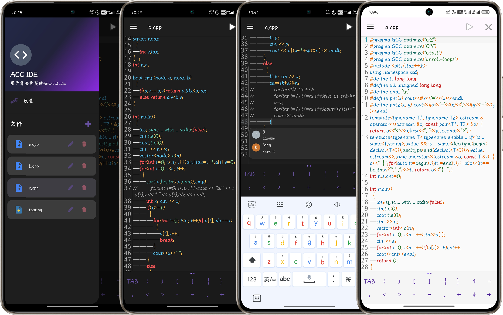

# ACC IDE

- [Version list](RELEASE.md)
- [English](README_en.md)
- [简体中文](README.md)

如果你对OJ平台自带的IDE对手机不友好，如果你也想在手机上把灵光一现的算法写出来，那么你应该试试ACC IDE🤗。

ACC IDE 是一个专为算法竞赛和编程比赛设计的，基于 Android 的原生集成开发环境。它旨在增强移动设备上的竞赛编程体验，为编写、测试和提交算法解决方案提供功能丰富的环境😋。

## 概述

ACC IDE 致力于为需要随时随地编码和测试算法的竞赛程序员提供全面的移动解决方案。该应用程序提供语法高亮、代码补全、文件管理等基本功能，专为算法竞赛量身定制。

## 项目结构

该项目遵循标准的 Android 应用程序架构，注重模块化组件：

### 核心结构
```
acc_ide_android/
├── app/
│   ├── src/
│   │   ├── main/
│   │   │   ├── java/com/acc_ide/
│   │   │   │   ├── adapter/       # RecyclerView 适配器
│   │   │   │   ├── dialog/        # 对话框组件
│   │   │   │   ├── model/         # 数据模型
│   │   │   │   ├── util/          # 工具类
│   │   │   │   ├── view/          # 自定义视图
│   │   │   │   ├── ui/            # UI 组件
│   │   │   │   ├── MainActivity.kt # 主应用程序入口点
│   │   │   │   ├── EditorFragment.kt # 代码编辑器实现
│   │   │   │   ├── IOPanelFragment.kt # 输入/输出面板
│   │   │   │   ├── SettingsFragment.kt # 应用程序设置
│   │   │   │   ├── WelcomeFragment.kt # 欢迎屏幕
│   │   │   │   └── NewFileDialogFragment.kt # 新文件创建对话框
│   │   │   ├── res/              # Android 资源文件
│   │   │   └── AndroidManifest.xml
│   ├── build.gradle             # 模块级构建配置
├── gradle/                      # Gradle 包装器文件
└── build.gradle                # 项目级构建配置
```

### 关键组件

#### 主活动 (`MainActivity.kt`)
应用程序的中心组件，负责管理：
- 文件导航抽屉
- Fragment 事务处理
- 存储权限管理
- 文件操作（创建、打开、保存、重命名、删除）
- 应用程序语言和主题设置

#### 编辑器 Fragment (`EditorFragment.kt`)
功能强大的代码编辑器，具有：
- 多语言语法高亮
- 代码补全功能
- 行号显示
- 代码块指示
- 通过手势控制字体大小
- 主题感知样式
- 自动缩进

#### IO 面板 Fragment (`IOPanelFragment.kt`)
一个用于：
- 输入/输出测试
- 查看执行结果
- 运行代码的接口

#### 设置 Fragment (`SettingsFragment.kt`)
用户首选项配置：
- 主题选择（深色/浅色模式）
- 字体大小调整
- 语言偏好设置
- 编辑器行为选项

#### 对话框组件
用于用户交互的各种对话框 Fragment：
- `NewFileDialogFragment.kt`：用于创建新代码文件
- dialog 包中的对话框类用于确认和输入

#### 工具层
`util` 包中的类：
- `FileStorageManager`：管理应用程序的文件操作
- `LocaleHelper`：处理本地化和语言切换

## 已实现功能

### 编辑器功能
- **强大的代码编辑**：基于 Sora Editor 库，并进行了性能优化
- **语法高亮**：支持 Java，对其他语言提供基本支持
- **代码补全**：根据上下文提供输入建议
- **主题支持**：深色和浅色模式，具有适当的语法着色
- **手势控制**：通过缩放手势调整字体大小
- **行号和代码块缩进**：提供代码结构视觉辅助
- **符号面板**：极简风格，移动端友好，支持一键输入常用编程符号，自动适配深浅主题。

### 文件管理
- **创建、打开、保存文件**：通过直观界面进行基本文件操作
- **文件浏览器**：带有可用文件列表的侧边抽屉
- **重命名和删除**：带有确认对话框的文件管理工具
- **自动保存**：自动保存更改，防止数据丢失

### 用户界面
- **响应式设计**：适用于不同大小的 Android 设备
- **导航抽屉**：轻松访问文件列表和设置
- **工具栏操作**：基于当前 Fragment 的上下文敏感操作
- **基于 Fragment 的导航**：不同屏幕之间的平滑过渡

### 自定义功能
- **语言选择**：可以在设置中更改界面语言
- **主题选择**：在深色和浅色主题之间切换
- **字体大小控制**：通过设置或手势调整编辑器字体大小
- **编辑器偏好**：通过设置自定义编辑器行为
- **光标粗细**：便于增强移动设备上的视觉体验 （实际上是作者懒得调光标😫）

### 输入/输出面板 （这个还没做完🤫）
- **测试输入**：输入测试数据以验证算法输出
- **输出显示**：查看执行结果
- **并行测试**：直接在 IDE 内测试算法功能

## 计划实现功能

### 编译器集成
- 集成 C/C++、Java 和 Python 编译器
- 本地编译和执行
- 支持不同编译器版本
- 编译进度指示器
- 在编辑器中高亮显示编译错误

### 问题状态检测
- 自动检测解决方案状态：
  - AC（通过）
  - WA（答案错误）
  - CE（编译错误）
  - MLE（内存超限）
  - TLE（时间超限）
  - RE（运行时错误）
- 执行时间和内存使用统计
- 测试用例结果可视化

### competitive-companion 集成
- Android 版本的 competitive-companion
- 直接从问题陈述导入测试用例
- 支持主要竞赛编程平台：
  - Codeforces
  - AtCoder
  - 洛谷
  - 牛客

## 安装

- 点击[releases](https://github.com/META-Xiao/acc_ide/releases/latest)安装最新版本
- 或者 `clone`项目到本地，使用 Android Studio 打开项目并运行

## 贡献

欢迎贡献！请随时提交 Pull Request。

## 许可证

本软件根据以下条件发布为开源软件：

1. 本软件可免费用于个人和非商业用途。
2. 允许商业使用，但要求：
   - 在商业使用前通知作者
   - 在任何商业产品或服务中明确标明原作者署名
3. 允许修改和再发布，前提是：
   - 保持原始许可条款
   - 保留对原作者的署名
   - 明确记录所做的更改

版权所有 © 2024 ACC IDE 项目。除本许可证中指定外，保留所有权利。

## 致谢

- [Sora Editor](https://github.com/Rosemoe/sora-editor) 提供代码编辑功能
- 本项目中使用的其他开源库

---

ACC IDE - 提升您在 Android 上的OJ体验。 